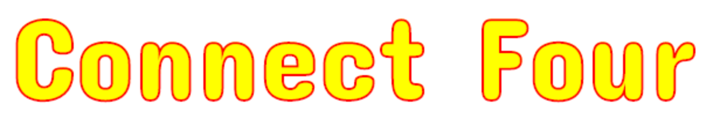
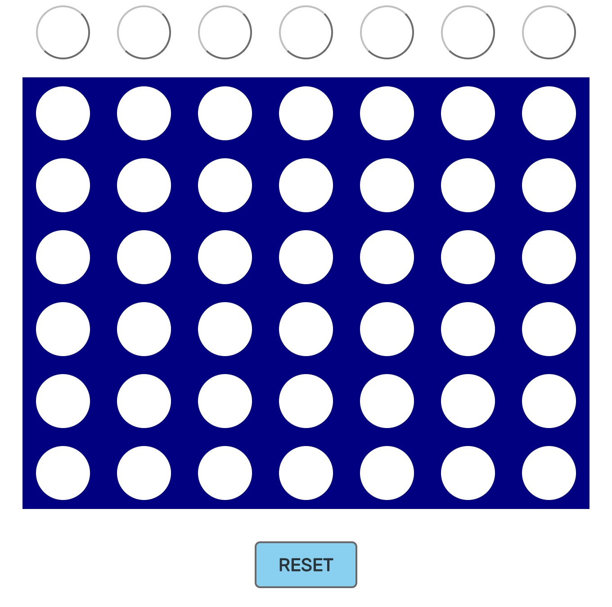
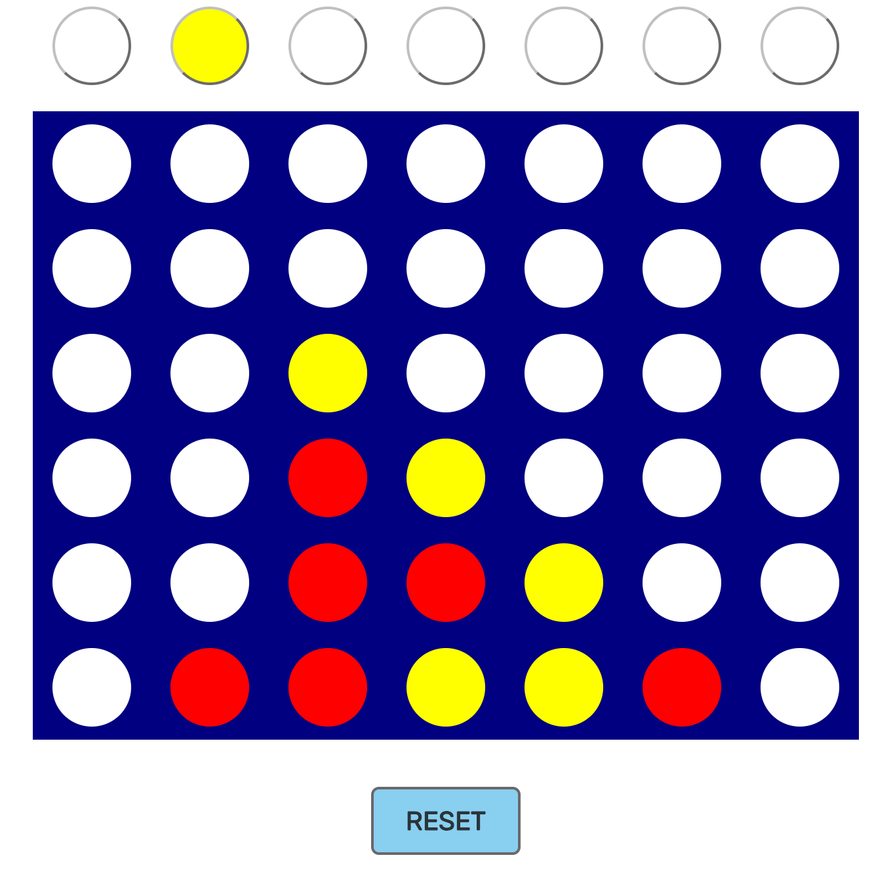
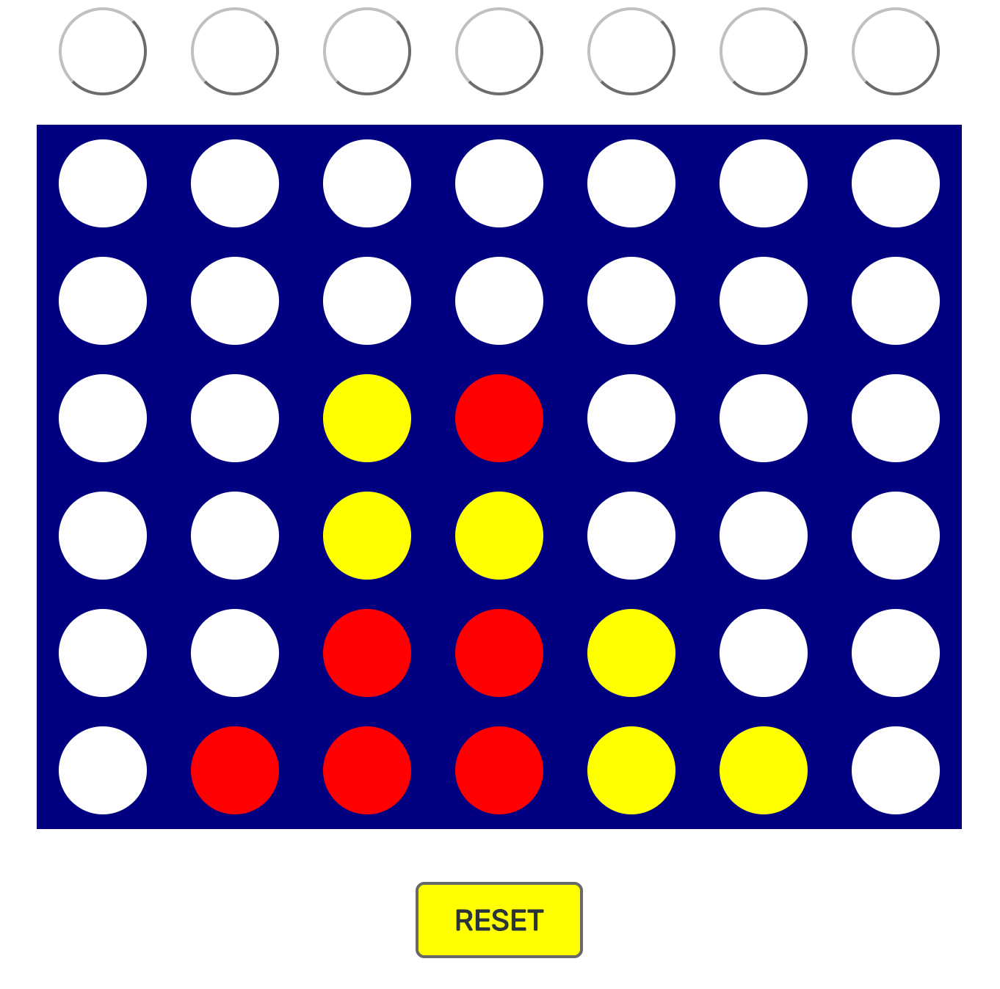
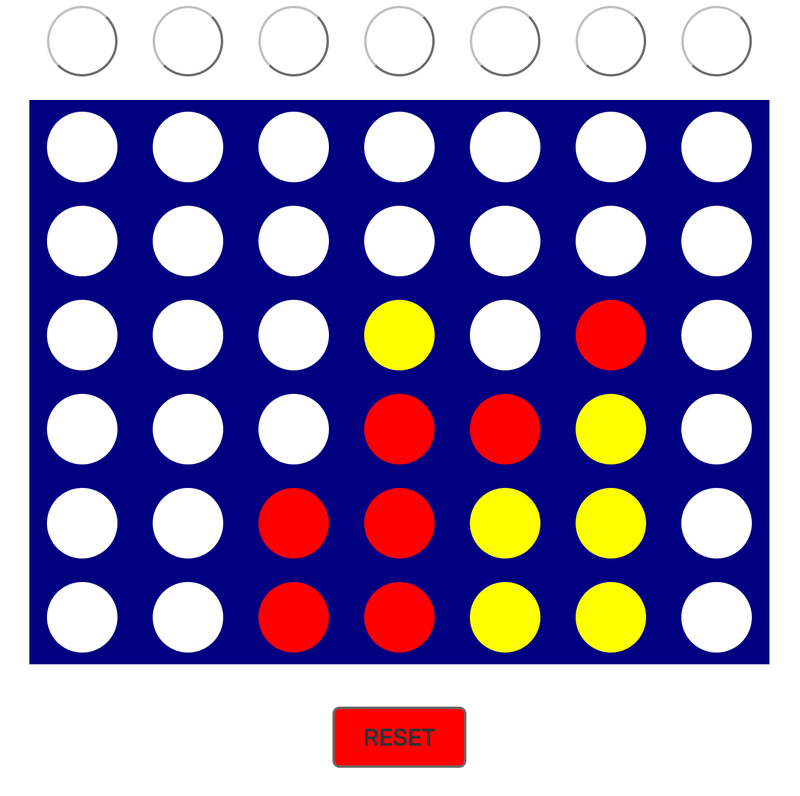

<h1 align="center">
  <br>
  <span>
    
  </span>
</h1>

<h4 align="center">The classic game built with React.</h4>

<h2 align="center">
  <a href="https://bcastell.github.io/connect-four">PLAY</a>
</h2>

## Screenshots
|  |    |
| ---------------------------------|-------------------------------------- |
| |         |

## Getting Started
To build and run this application on a local server, follow the instructions below.

### Clone
Clone the remote repository.
```
git clone https://github.com/bcastell/connect-four
```

### Navigation
Enter the root directory of the local repository.
```
cd location/where/repository/is/saved/scribble
```

### Build and Run
Build the application.
```
npm run build
```

Start the server.
```
npm run start
```

In your favorite browser's address bar, type the local host address and port number specified after running ```npm run start```

## Authors
* **Brandon Castellanos** - [GitHub](https://github.com/bcastell)

## License
This project is licensed under the MIT License - see the [LICENSE](LICENSE) file for details.
